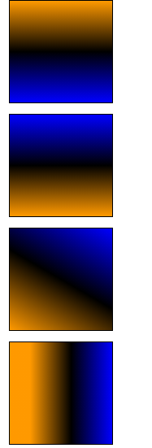
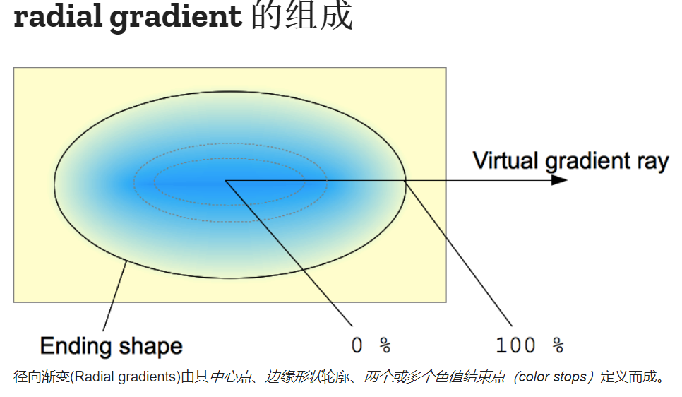

### 线性渐变 linear-gradient

* 文档地址： https://developer.mozilla.org/zh-CN/docs/Web/CSS/linear-gradient()
* 不传方向默认to bottom(自上而下)

``` css
  .linear1 {
      background: linear-gradient(#f90, #0f0, #00f);
  }
```

* 第一个参数传递渐变走向，

    1. 可传递具体方向
        - to left(自左向右), to top(自下而上), to left top(从左上到右下)  

    

``` css
            .linear2 {
                background: linear-gradient(to top, #f90, #0f0, #00f);
            }
```

    2. 传递角度 90reg

            

``` css
            .linear3 {
                background: linear-gradient(30deg, #f90, #0f0, #00f);
            }
```

    

* 每个颜色后面可以传递渐变中心, 可以是像素/百分比

``` css
            .linear4 {
                background: linear-gradient(to right, #f90 20%, #0f0 60%, #00f 100%);
            }
```



### 径向渐变 radial-gradient

* `文档地址`：https://developer.mozilla.org/zh-CN/docs/Web/CSS/radial-gradient()

==语法：radial-gradient(形状 大小 at 圆心位置, 颜色 渐变中心, ...)==

       background: radial-gradient(ellipse closest-corner at 40px 40px, #f90 10%, #000 50%, #00f);

* 默认原点在中心 扩散到角
* 边缘形状可以是圆形（circle）或椭圆形（ellipse）。
* size扩散大小：
    - `closest-side` 渐变的边缘形状与容器距离渐变中心点最近的一边相切（圆形）或者至少与距离渐变中心点最近的垂直和水平边相切（椭圆）。
    - `closest-corner` 渐变的边缘形状与容器距离渐变中心点最近的一个角相交。
    - `farthest-side` 与closest-side相反，边缘形状与容器距离渐变中心点最远的一边相切（或最远的垂直和水平边）。
    - `farthest-corner` 渐变的边缘形状与容器距离渐变中心点最远的一个角相交。



``` css
          .radial1 {
              background: radial-gradient(#f90, #000, #00f);
          }
```
