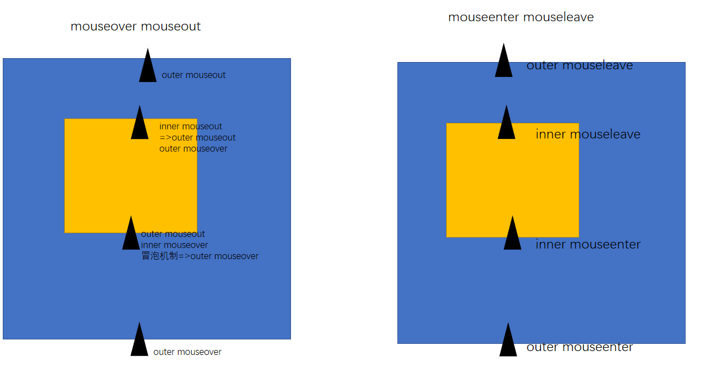

#### mouseover和mouseout存在事件的冒泡传播机制
- 从父元素进入子元素，属于离开父元素，进入子元素
- 从子元素进入父元素，属于离开子元素，进入父元素
- 它忽略了层级关系，一切按照鼠标在谁的上面来决定over/out
#### mouseenter和mouseleave默认阻止了事件的冒泡传播机制
- 从父元素进入子元素，属于进入了子元素，并没有离开父元素，所以父元素的leave不触发
- 从子元素进入父元素，属于离开了子元素，因为还在父元素中，所以也不算重新进入父元素，父元素的enter也不会触发