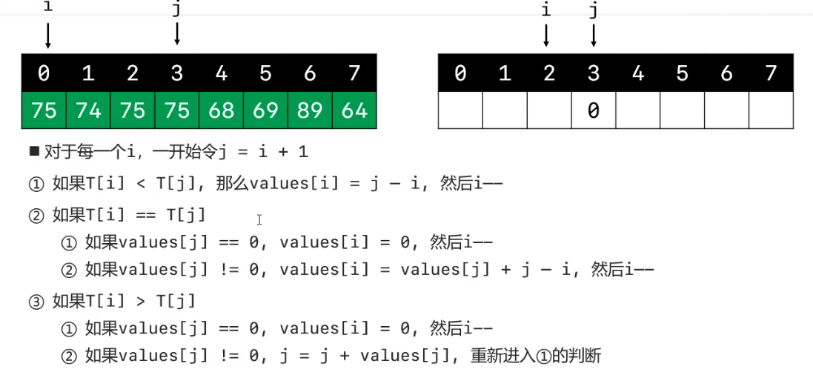

#### java实现
```java
// 栈结构
class Test {
    public static int[] dailyTemperatures(int[] T) {
        if (T == null || T.length == 0) return null;
        int[] result = new int[T.length];
        // i 初识为数组倒数第二个元素
        for (int i = T.length - 2; i >= 0; i--) {
            // j 初识为i后一位
            int j = i + 1;
            // 进入循环
            while (true) {
                // 如果i日期的温度小于j日期的温度，i日期下一个比它大的温度就是j日期，j-i就是天数差
                if (T[i] < T[j]) {
                    result[i] = j - i;
                    break;
                }
                // 如果i日期的温度大于等于j日期的温度，并且j日期以后的温度都是比j日期温度低，就没有比i日期温度高的日期了
                else if (T[j] == 0) {
                    result[i] = 0;
                    break;
                }
                // 如果i日期的温度大于等于j日期的温度,并且j日期后面有比j日期温度高的日期
                // j跳到第一个比它大的日期
                j = j + result[j];
            }
        }
        return result;
    }
    // 倒推法
    public static int[] dailyTemperatures1(int[] T) {
        if (T == null || T.length == 0) return null;
        int[] values = new int[T.length];
        for (int i = T.length - 2; i >= 0; i--) {
            int j = i + 1;
            while (true) {
                if (T[i] < T[j]) {
                    values[i] = j - i;
                    break;
                } else if (values[j] == 0) {
                    values[i] = 0;
                    break;
                } else if (T[i] == T[j]) {
                    values[i] = values[j] + j - i;
                    break;
                } else {
                    j = j + values[j];
                }
            }
        }
        return values;
    }
}
```
#### javascript实现
```javascript
// 栈结构
const dailyTemperatures = function(T) {
    if(T == null || T.length ==0)return null;
    const len = T.length;
    const stack = [];
    const result = new Array(len);
    result.fill(0);
    for(let i = 0; i < len; i++){
       while(stack.length!==0&&T[i]>T[stack[stack.length - 1]]){
          result[stack[ stack.length - 1]] = i - stack[stack.length - 1];
          stack.pop();
      }
      stack.push(i);                                                    
    }
    return result;
};
// 倒推法
const dailyTemperatures = function (T) {
    if (T == null || T.length === 0) return null;
    const values = new Array(T.length);
    values.fill(0);
    for (let i = T.length - 2; i >= 0; i--) {
        let j = i + 1;
        while (true) {
            if (T[i] < T[j]) {
                values[i] = j - i;
                break;
            } else if (values[j] === 0) {
                values[i] = 0;
                break;
            } else if (T[i] === T[j]) {
                values[i] = values[j] + j - i;
                break;
            } else {
                j = j + values[j];
            }
        }
    }
    return values;
};
```