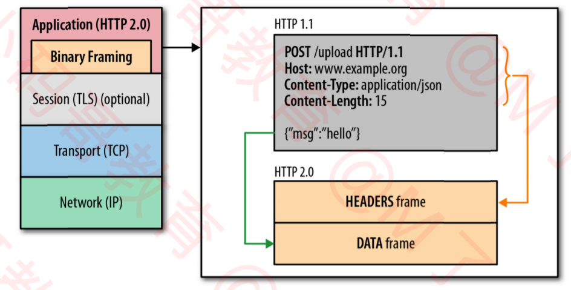
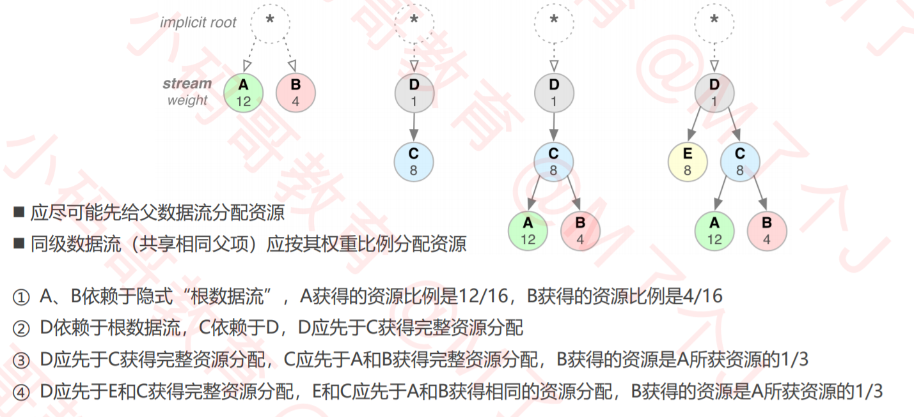
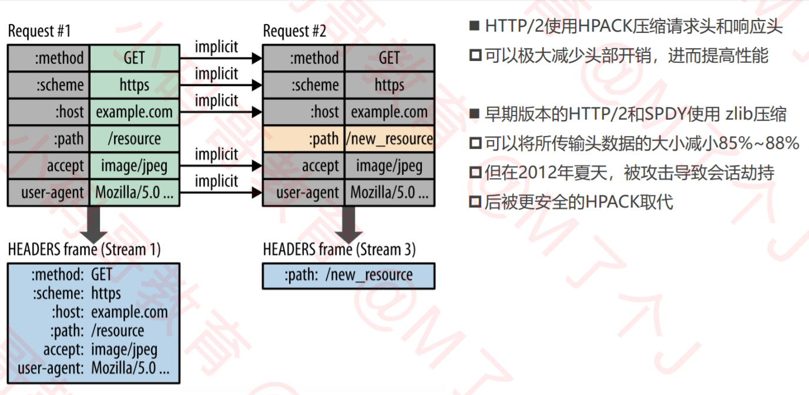
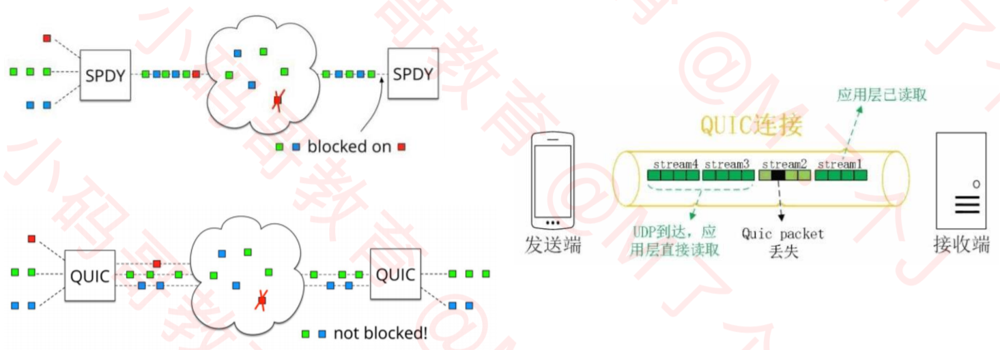
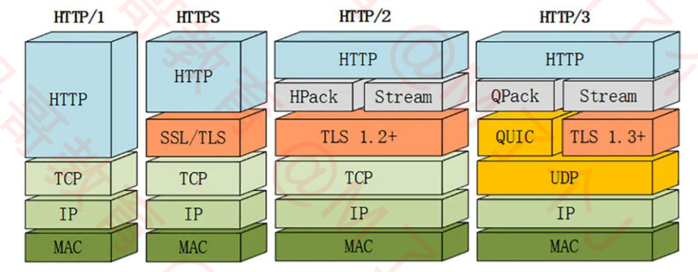

### HTTP/1.1的不足
1. 同一时间，一个连接只能对应一个请求
2. 针对同一个域名，大多数浏览器允许同时最多6个并发连接
3. 只允许客户端主动发起请求，一个请求只能对应一个响应
4. 同一个会话的多次请求中，头信息会被重复传输，通常会给每个传输增加500~800字节的开销，如果使用 Cookie，增加的开销有时会达到上千字节
### HTTP/2 
- 前身是谷歌的SPDY协议
- HTTP/2，于2015年5月以RFC 7540正式发表
- 根据W3Techs的数据，截至2019年6月，全球有36.5%的网站支持了HTTP/2
- HTTP/2在底层传输做了很多的改进和优化，但在语意上完全与HTTP/1.1兼容
- 因此，要想升级到HTTP/2，开发者不需要修改代码，只要升级服务器配置，升级浏览器
#### HTTP/2一些基本的概念

- 数据流：已建立的连接内的双向字节流，可以承载一条或多条消息
- 所有通信都在一个TCP连接上完成，此连接可以承载任意数量的双向数据流
- 消息：与逻辑HTTP请求或响应消息对应，由一系列帧组成
- 帧：HTTP/2通信的最小单位，每个帧都包含帧头（会标识出当前帧所属的数据流），来自不同数据流的帧可以交错发送，然后再根据每个帧头的数据流标识符重新组装
#### HTTP/2的特点
1. HTTP/2采用二进制格式传输数据，而非HTTP/1.1的文本格式，二进制格式在协议的解析和优化扩展上带来更多的优势和可能
2. 优先级
- HTTP/2 标准允许每个数据流都有一个关联的权重和依赖关系，可以向每个数据流分配一个介于1至256之间的整数，每个数据流与其他数据流之间可以存在显式依赖关系
- 客户端可以构建和传递“优先级树”，表明它倾向于如何接收响应
- 服务器可以使用此信息通过控制CPU、内存和其他资源的分配设定数据流处理的优先级
- 在资源数据可用之后，确保将高优先级响应以最优方式传输至客户端

3. 头部压缩

4. 服务器推送
- 服务器可以对一个客户端请求发送多个响应，除了对最初请求的响应外，服务器还可以向客户端推送额外资源，而无需客户端额外明确地请求
#### 多路复用
- 客户端和服务器可以将 HTTP消息分解为互不依赖的帧，然后交错发送，最后再在另一端把它们重新组装起来
- 并行交错地发送多个请求，请求之间互不影响
- 并行交错地发送多个响应，响应之间互不干扰
- 使用一个连接并行发送多个请求和响应
- 不必再为绕过HTTP/1.1限制而做很多工作，比如为了减少http请求需要雪碧图、合并CSS\JS、内嵌CSS\JS\Base64图片、同一个域名最多只有六个并发连接，就需要域名分片等
#### HTTP/2的问题（队头阻塞）

### HTTP/3
- Google觉得HTTP/2仍然不够快，于是就有了HTTP/3
- HTTP/3由Google开发，弃用TCP协议，改为使用基于UDP协议的QUIC协议实现

#### HTTP/3是基于UDP的，需要QUIC来保证
#### HTTP/3的特性
1. 连接迁移
- TCP基于4要素（源IP、源端口、目标IP、目标端口） 
    + 切换网络时至少会有一个要素发生变化，导致连接发生变化
    + 当连接发生变化时，如果还使用原来的TCP连接，则会导致连接失败，就得等原来的连接超时后重新建立连接
    + 所以我们有时候发现切换到一个新网络时，即使新网络状况良好，但内容还是需要加载很久
    + 如果实现得好，当检测到网络变化时立刻建立新的TCP连接，即使这样，建立新的连接还是需要几百毫秒的时间
- QUIC的连接不受4要素的影响，当4要素发生变化时，原连接依然维持
    + QUIC连接不以4要素作为标识，而是使用一组Connection ID（连接ID）来标识一个连接
    + 即使IP或者端口发生变化，只要Connection ID没有变化，那么连接依然可以维持
    + 比如当设备连接到Wi-Fi时，将进行中的下载从蜂窝网络连接转移到更快速的Wi-Fi连接，当Wi-Fi连接不再可用时，将连接转移到蜂窝网络连接
- 操作系统内核、 CPU负载
    + 据Google和Facebook称，与基于TLS的HTTP/2相比，它们大规模部署的QUIC需要近2倍的CPU使用量
    + Linux内核的UDP部分没有得到像TCP那样的优化，因为传统上没有使用UDP进行如此高速的信息传输
    + TCP和TLS有硬件加速，而这对于UDP很罕见，对于QUIC则基本不存在