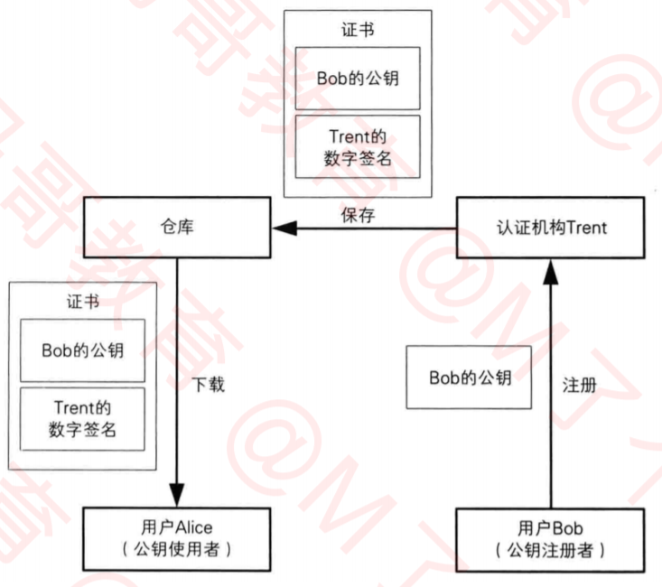

## http协议的安全问题
- 由于HTTP协议默认是采取明文传输的，因此会有很大的安全隐患
- 常见的提高安全性的做法是对传输内容进行加密
### 单向散列函数
- 单向散列函数，可以根据根据消息内容计算出散列值
- 散列值的长度和消息的长度无关，无论消息是1bit、10M、100G，单向散列函数都会计算出固定长度的散列值
特点：
    1. 根据任意长度的消息，计算出固定长度的散列值
    2. 计算速度快，能快速计算出散列值
    3. 消息不同，散列值也不同
    4. 具备单向性，不提供解密
称呼：
    1. 消息摘要函数
    2. 哈希函数
    3. 输出的散列值，也被称为消息摘要或者指纹
应用：
    1. 防止数据被篡改
    2. 我们平时登录网站的密码大多是使用单向散列函数进行处理过才存入数据库的，更加安全，就算数据库被黑客获取，也可以黑客也很难获取用户真实的密码，所以当我们忘记密码后，一般网站都会直接重置新的密码，而不会告诉你旧的密码，因为网站也不知道你的密码具体是什么

### 常见的加密方式有
1. 不可逆的，比如单向散列函数：MD5
2. 可逆的
    - 对称加密：3DES、AES等
    - 非对称加密：RSA等
#### 对称加密
- 对称加密加密解密的时所用的秘钥是相同的
- 优点是加密解密的速度快
- 但是将秘钥从A传输到B，就可能被黑客获取秘钥
- 解决秘钥配送安全问题
    1. 私下共享秘钥
    2. 密钥分配中心
#### 非对称加密
- 加密中公钥私钥是不同的，私钥加密，公钥解密，或者私钥加密，公钥解密
- 缺点就是加密解密速度慢，大量数据进行传输，不适用
#### 混合密码系统(将对称加密和非对称加密的优势相结合的方法)
- 解决了非对称加密速度慢的问题
- 通过非对称加密解决了对称加密的密钥配送问题
- 网络上的密码通信所用的SSL/TLS都运用了混合密码系统
##### 会话密钥
- 为本次通信随机生成的临时密钥
- 使用对称加密的密钥，用于加密消息，提高速度
##### 加密步骤（发送消息）
1. 首先，消息发送者要拥有消息接收者的公钥
2. 生成会话密钥，作为对称加密的密钥，加密消息
3. 用消息接收者的公钥，加密会话密钥
4. 将前 步生成的加密结果，一并发给消息接收者
##### 发送出去的内容包括
- 用会话密钥加密的消息（加密方法：对称加密）
- 用公钥加密的会话密钥（加密方法：非对称加密）
##### 解密步骤
1. 消息接收者用自己的私钥解密出会话密钥
2. 再用第1步解密出来的会话密钥，解密消息
##### 混合密码加密解密流程
发送者：A     接受者： B
- 发送过程（加密过程）
1. B生成一对公钥、私钥
2. A拿到B的公钥
3. A随机生成一个会话秘钥（临时秘钥）
4. A用会话秘钥加密所需要发送的消息（对称加密）
5. A用B的公钥加密会话秘钥（使用非对称加密）
6. A将4,5加密的消息数据，一起发送给B
- 接收过程（解密过程）
1. B利用自己的私钥解密，得到会话密钥（使用的是非对称加密算法进行解密）
2. B利用会话密钥解密发送过来的消息（使用对称加密算法）
- 这样看起来，似乎很安全了，但是如果C篡改了A发送的消息，或者C伪装成A向B发送消息呢，B怎么识别呢，这时就需要数字签名了
##### 数字签名
- 数字签名的目的是识别内容有没有被篡改，不起加密作用
- 生成签名：由消息的发送者完成，通过“签名密钥”生成
- 验证签名：由消息的接收者完成，通过“验证密钥”验证
- 在非对称加密中，任何人都可以使用公钥进行加密，在数字签名中，任何人都可以使用公钥验证签名
- 如何能保证这个签名是消息发送者自己签的？==> 用消息发送者的私钥进行签名
- 数字签名过程如图：

- 使用非对称加密，加密解密速度较慢，可以利用单向散列函数处理

- 数字签名其实就是将非对称加密反过来使用

- 既然是加密，那肯定是不希望别人知道我的消息，所以只有我才能解密（公钥负责加密，私钥负责解密）
-  既然是签名，那肯定是不希望有人冒充我发消息，所以只有我才能签名（私钥负责签名，公钥负责验签）
##### 证书
- 如果遭到中间人攻击，A得到的公钥可能是伪造的，就需要证书了
- 证书用于验证公钥的合法性
- 密码学中的证书，全称叫公钥证书
- 里面有姓名、邮箱等个人信息，以及此人的公钥
- 并由认证机构（Certificate Authority，CA）施加数字签名
- CA就是能够认定“公钥确实属于此人”并能够生成数字签名的个人或者组织
    + 有国际性组织、政府设立的组织
    + 有通过提供认证服务来盈利的企业
    + 个人也可以成立认证机构
- 使用流程：

- 证书注册和下载

- 各大CA的公钥，默认已经内置在浏览器和操作系统中
- 查看已经信任的证书
1. Windows键 + R >>> 输入mmc
2. 文件 >>> 添加/删除管理单元
3.  证书 >>> 添加 >>> 我的用户账户 >>> 完成 >>> 确定

