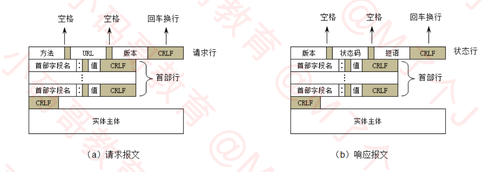
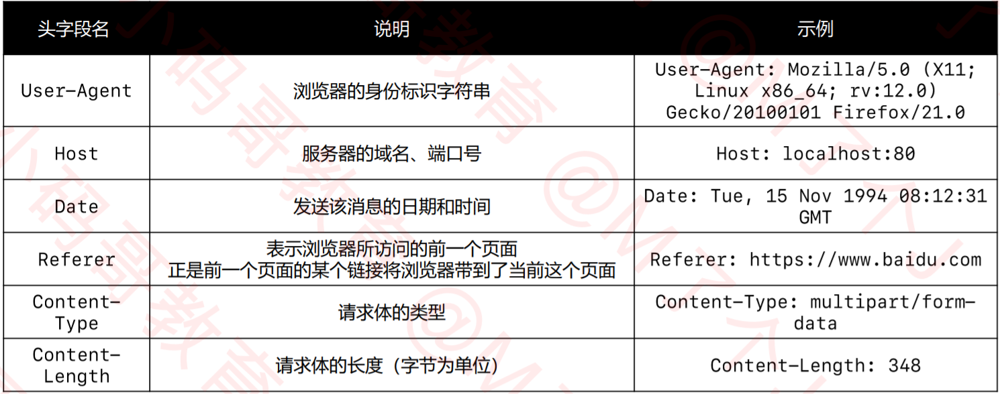
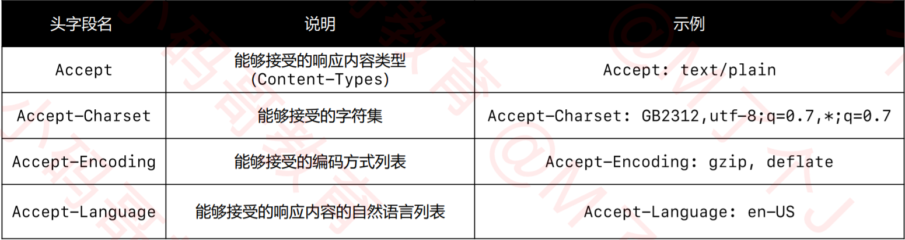
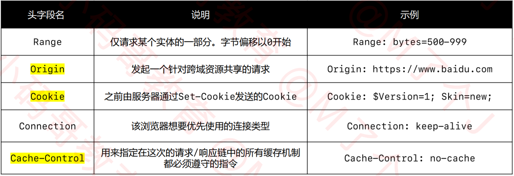
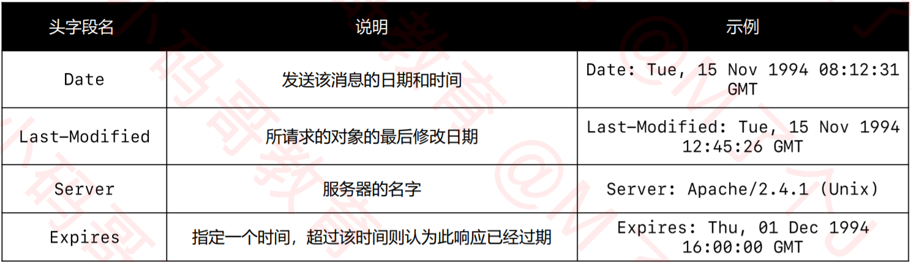
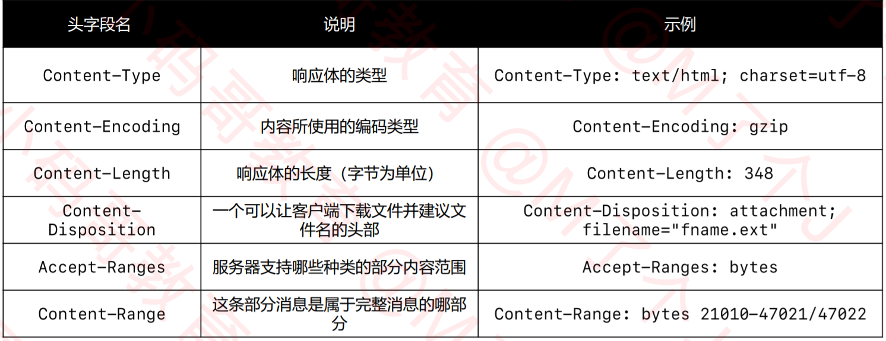
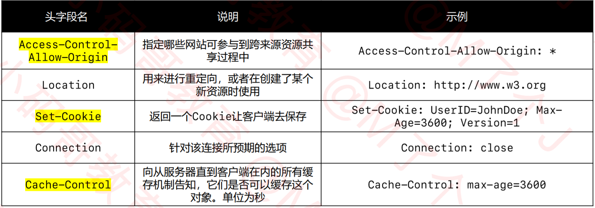

# HTTP
- HTTP（Hyper Text Transfer Protocol），译为超文本传输协议
- 设计HTTP最初的目的是：提供一种发布和接收HTML页面的方法，由URI来标识具体的资源
- 后面用HTTP来传递的数据格式不仅仅是HTML，应用非常广泛
## 版本
- 1991年，HTTP/0.9
    只支持GET请求方法获取文本数据（比如HTML文档），且不支持请求头、响应头等，无法向服务器传递太多信息
- 1996年，HTTP/1.0
    支持POST、HEAD等请求方法，支持请求头、响应头等，支持更多种数据类型（不再局限于文本数据）
    浏览器的每次请求都需要与服务器建立一个TCP连接，请求处理完成后立即断开TCP连接
- 1997年，HTTP/1.1（最经典、使用最广泛的版本）
    支持PUT、DELETE等请求方法
    采用持久连接（Connection: keep-alive），多个请求可以共用同一个TCP连接
- 2015年，HTTP/2.0
- 2018年，HTTP/3.0
## 报文格式

## 请求方法
- RFC描述了九种方法：GET、HEAD、POST、PUT、DELETE、CONNECT、OPTIONS、TRACE、PATCH
- GET：常用于读取的操作，请求参数直接拼接在URL的后面（浏览器对URL是有长度限制的）
- POST：常用于添加、修改、删除的操作，请求参数可以放到请求体中（没有大小限制）
- HEAD：请求得到与GET请求相同的响应，但没有响应体，用时测试是否能获取数据
- OPTIONS：用于获取目的资源所支持的通信选项，比如服务器支持的请求方法
- PUT：用于对已存在的资源进行整体覆盖
- PATCH：用于对资源进行部分修改（资源不存在，会创建新的资源）
- DELETE：用于删除指定的资源
- TRACE：请求服务器回显其收到的请求信息，主要用于HTTP请求的测试或诊断
- CONNECT：可以开启一个客户端与所请求资源之间的双向沟通的通道，它可以用来创建隧道（tunnel），可以用来访问采用了 SSL (HTTPS) 协议的站点
## 请求头字段

## 响应头字段

