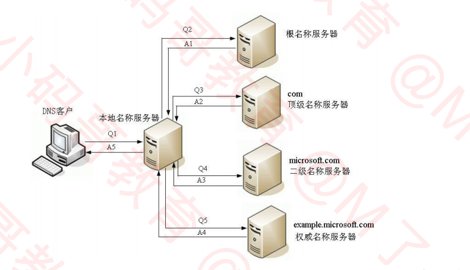
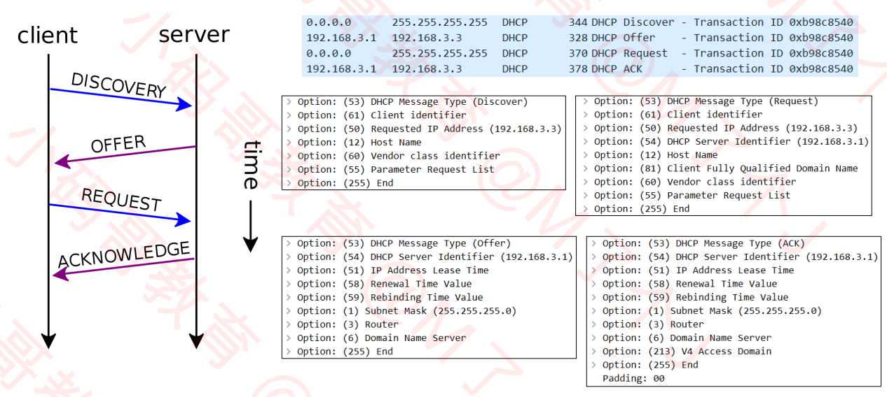

## 应用层的常见协议

    ◼ 超文本传输：HTTP、HTTPS
    ◼ 文件传输：FTP
    ◼ 电子邮件：SMTP、POP3、IMAP
    ◼ 动态主机配置：DHCP
    ◼ 域名系统：DNS

## 域名 (Domain Name)

    1. 由于IP地址不方便记忆，并且不能表达组织的名称和性质，人们设计出了域名（比如baidu.com）
    2. 但实际上，为了能够访问到具体的主机，最终还是得知道目标主机的IP地址
    3. 如果直接事使用使用域名，IP地址固定4个字节，域名随随便便都至少10几个字节，这无疑会增加路由器的负担，浪费流量

## DNS (Domain Name System)

    1. 利用DNS协议，可以将域名（比如baidu.com）解析成对应的IP地址（比如220.181.38.148）
    2. DNS可以基于UDP协议，也可以基于TCP协议，服务器占用53端口

    
#### DNS查找流程图

◼ 客户端首先会访问最近的一台DNS服务器（也就是客户端自己配置的DNS服务器）
◼ 所有的DNS服务器都记录了DNS根域名服务器的IP地址
◼ 上级DNS服务器记录了下一级DNS服务器的IP地址
◼ 全球一共13台IPv4的DNS根域名服务器、25台IPv6的DNS根域名服务器
#### 关于DNS一些常用命令
-  ipconfig /displaydns：查看DNS缓存记录
- ipconfig /flushdns：清空DNS缓存记录
- ping 域名
-  nslookup 域名
## IP地址的分配
- IP地址按照分配方式，可以分为：静态IP地址、动态IP地址
- 静态IP地址
  + 需要手动设置
  + 适用场景：不怎么挪动的台式机（比如学校机房中的台式机）、服务器等
- 动态IP地址
  + 适用场景：移动设备、无线设备等
  + 从DHCP服务器自动获取IP地址
## DHCP (Dynamic Host Configuration Protocol)
- DHCP协议基于UDP协议，客户端是68端口，服务器是67端口
- DHCP服务器会从IP地址池中，挑选一个IP地址“出租“给客户端一段时间，时间到期就回收它们
- 平时家里上网的路由器就可以充当DHCP服务器
#### DHCP分配IP地址的四个阶段
1. DISCOVER：发现服务器
   - 发广播包（源IP是0.0.0.0，目标IP是255.255.255.255，目标MAC是FF:FF:FF:FF:FF:FF）
2. OFFER：提供租约
   - 服务器返回可以租用的IP地址，以及租用期限、子网掩码、网关、DNS等信息
   - 注意：这里可能会有多个服务器提供租约
3. REQUEST：选择IP地址
   - 客户端选择一个OFFER，发送广播包进行回应
4. ACKNOWLEDGE：确认
   - 被选中的服务器发送ACK数据包给客户端

